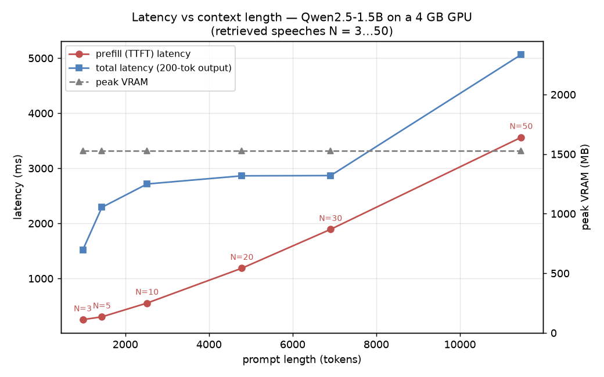

# Long-context / KV-cache profiling: how retrieval count drives latency

**Question:** every additional retrieved speech makes the RAG prompt longer. How does
context length affect **time-to-first-token** (prefill — the step that builds the prompt's
KV cache), total latency, and VRAM? This is a simplified experiment observing "the effect of
long context on inference performance" without changing the underlying inference engine.

**Method** ([`scripts/benchmark_context_length.py`](../scripts/benchmark_context_length.py)):
2 fixed real queries, feeding retrieval counts N = [3, 5, 10, 20, 30, 50] to `qwen2.5:1.5b`
in turn, 3 runs per point. Reads Ollama's own `prompt_eval_count` (real prompt token count)
and `prompt_eval_duration` (the engine's measured prefill time) directly — both the x-axis
and the prefill cost are **measured, not estimated**.

- **Why 1.5B and not the production 8B:** the 1.5B stays fully resident in the 4 GB GPU, so
  its prefill reflects **true attention-compute scaling**; the 8B has 58% spilled to CPU with
  a TTFT already ~50 seconds, and that CPU noise would drown out the signal. The 8B inherits
  the same scaling, just amplified by the spill.
- **Two measurement pitfalls (hit and fixed):** ① Ollama caches a prompt's KV and reuses the
  longest common prefix, so **rerunning the same prompt just skips prefill (~10 ms)** —
  fixed by prepending a unique nonce to force a cold prefill each time. ② A prompt hitting the
  `num_ctx` ceiling gets truncated, which cuts off the nonce and turns it back into a cache
  hit — fixed by raising `num_ctx` to 12288 so the longest N=50 (~11.5k tokens) is never
  truncated.

## Results

| N | prompt tokens | prefill (ms) | ms/token | total latency (ms) | peak VRAM (MB) |
|---|---|---|---|---|---|
| 3 | 984 | 253 | 0.26 | 1517 | 1529 |
| 5 | 1440 | 304 | 0.21 | 2292 | 1529 |
| 10 | 2520 | 554 | 0.22 | 2716 | 1529 |
| 20 | 4787 | 1187 | 0.25 | 2864 | 1529 |
| 30 | 6909 | 1893 | 0.27 | 2868 | 1529 |
| 50 | 11465 | 3562 | 0.31 | 5065 | 1529 |

## Conclusions

1. **Prefill scales roughly linearly with context, then starts turning super-linear.** Token
   count rises 11.6× (984 → 11465) while prefill rises 14× (253 → 3562 ms) — per-token cost
   climbs from ~0.21 to ~0.31 ms, meaning **attention's O(n²) term starts showing up at long
   context** (stacking on top of the linear FFN term). This is expected attention-mechanism
   behavior, and the data shows the inflection clearly.

2. **VRAM is unrelated to prompt length — it's set by `num_ctx`.** As N goes from 3 to 50 and
   the prompt grows from 984 to 11465 tokens, peak VRAM **sits flat at 1529 MB the entire
   time**; but raising `num_ctx` from 8192 to 12288 lifted it from 1409 to 1529 MB across the
   board. This means **Ollama/llama.cpp pre-allocates the KV cache at load time, sized by the
   context window** — the VRAM cost of "supporting long context" is **paid upfront**,
   regardless of how much you actually use. On a 4 GB card, this KV-cache floor competes
   directly with model weights for VRAM.

3. **What this means for the project.** Production retrieval defaults to ~8-10 speeches
   (capped at 8 in [`rag.py`](../library/myhansard/rag.py)), which sits in the **cheap
   region** of the curve (~2500 tokens, ~550 ms prefill). Retrieving 50 speeches (~11.5k
   tokens) pushes prefill to 3.5 seconds — TTFT ~6.5× slower — for a fairly limited gain in
   retrieval quality. **The current default is a reasonable sweet spot between latency and
   recall.** Supporting longer context in the future faces two bottlenecks: prefill's
   quadratic growth, and the KV-cache VRAM paid upfront to widen `num_ctx` — the latter is
   exactly why the already-spilling 8B simply can't fit a large context on 4 GB.
