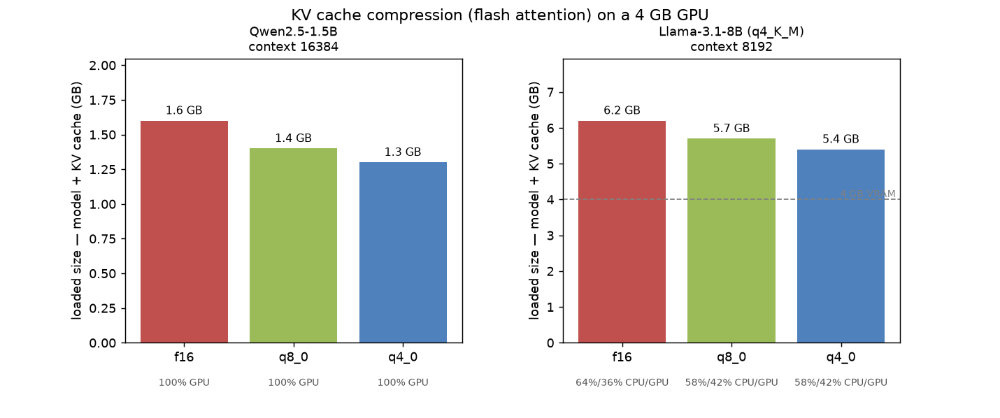

# KV-cache compression (Ollama) on a 4 GB GPU

**Question:** the target role calls for *"KV cache management and compression."* Ollama
provides exactly that lever — with flash attention on, `OLLAMA_KV_CACHE_TYPE` can store the
K/V cache as **f16 (default) / q8_0 / q4_0**. On a 4 GB card, the KV cache competes with
model weights for VRAM, so **compressing the KV cache means more room for longer context or a
bigger model.**

**Method** ([`scripts/benchmark_kv_cache.py`](../scripts/benchmark_kv_cache.py)): for each KV
type, spin up a **separate throwaway Ollama instance on :11435** (with the matching env var,
leaving the main :11434 service untouched, no sudo needed), load the model at a fixed context
window, and record: loaded footprint (`ollama ps` SIZE = model + KV cache), GPU/CPU layer
split, peak VRAM, prefill, and generation tokens/sec. A warmup run is discarded before timing
to avoid cold-start noise.

- **Why look at "loaded footprint" rather than raw VRAM:** when the model fits (1.5B), VRAM
  directly reflects the KV cache; but when the 8B spills, `nvidia-smi` VRAM caps out at
  ~2.3 GB and gets noisy — what's actually moving is the **loaded footprint** and the
  **GPU/CPU split**.



## Results

| Model | KV type | Loaded footprint | Savings | GPU/CPU split | tok/s |
|---|---|---|---|---|---|
| Qwen2.5-1.5B @ 16k | f16 | 1.6 GB | — | 100% GPU | 106 |
| | **q8_0** | 1.4 GB | −0.2 GB | 100% GPU | 100 |
| | q4_0 | 1.3 GB | −0.3 GB | 100% GPU | ⚠️ see below |
| **Llama-3.1-8B** (production) @ 8k | f16 | 6.2 GB | — | 64%/36% CPU/GPU | 7.4 |
| | **q8_0** | 5.7 GB | −0.5 GB | **58%/42% CPU/GPU** | **8.0** |
| | q4_0 | 5.4 GB | −0.8 GB | 58%/42% CPU/GPU | 5.1 |

## Conclusions

1. **Compression genuinely saves VRAM, and costs the resident model almost nothing in
   speed.** For Qwen-1.5B @ 16k: compressing the KV from f16 to q4_0 takes the footprint from
   1.6 → 1.3 GB, and q8_0's generation speed (100) nearly matches f16's (106). In other
   words, when the model already fits, q8_0 saves KV-cache VRAM almost for free — VRAM that
   can go toward **supporting longer context**.

2. **For the production 8B (the spilling case), compression pulls layers back onto the
   GPU.** At 8k context, the f16 KV cache is roughly 1 GB and pushes the model further onto
   CPU — **only 36% on GPU**; compressing to **q8_0 saves 0.5 GB, brings the GPU share back
   to 42%, and lifts generation from 7.4 to 8.0 tok/s**. This is exactly the hardware-aware
   payoff: *on constrained VRAM, compressing the KV cache reduces the 8B's CPU offload and
   speeds it up.*

3. **q8_0 is the sweet spot for the 8B — more compression isn't automatically better.** q4_0
   saves the most (−0.8 GB), but the extra dequantization overhead drops generation to
   5.1 tok/s — slower than q8_0. **q8_0 is the best balance between "saves VRAM" and
   "doesn't add decode overhead."**

4. **An honest caveat:** q4_0 produced no usable output on Qwen-1.5B this run (tokens/sec ≈
   0) — **overly aggressive KV quantization can break generation quality/stability for some
   models**, so verify per-model before shipping it.

**Reproduce** (no torch needed):
```bash
uv run python scripts/benchmark_kv_cache.py
uv run python scripts/analyze_kv_cache.py
```

> Deployment takeaway: on 4 GB, run the production 8B with
> `OLLAMA_FLASH_ATTENTION=1 OLLAMA_KV_CACHE_TYPE=q8_0` to cut spill at essentially no quality
> cost; the VRAM this frees up is exactly what supporting longer context would need.
