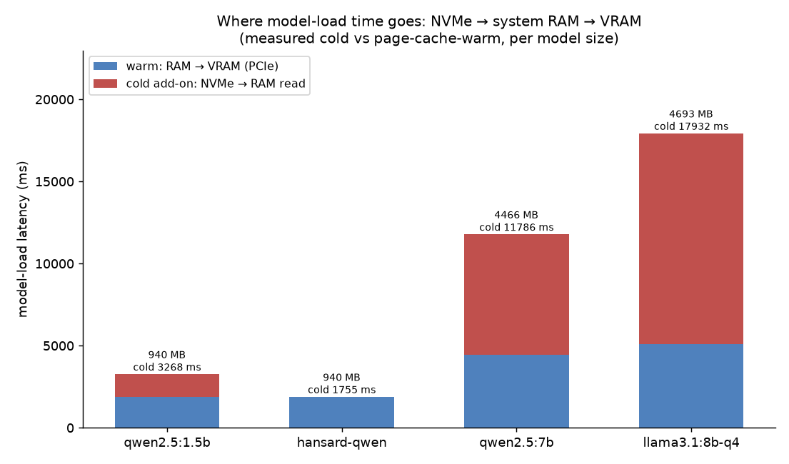

# Model-load profiling: NVMe → system RAM → VRAM

**Question:** every time a model is (re)loaded onto the GPU, its weights travel the chain
**NVMe → system RAM → VRAM**. The target role explicitly asks for *"optimize data transfer
between NVMe storage, system memory, and GPUs."* How large is this cost? On a 4 GB card that
can't hold the 8B and swaps models frequently, this bill gets paid over and over.

**Method** ([`scripts/benchmark_nvme.py`](../scripts/benchmark_nvme.py)): for each model,
unload it from VRAM with `keep_alive:0`, then send one request to trigger a (re)load and read
`load_duration` from Ollama's response. Each model runs 3 times — **run 0 is a cold load**
(the file isn't in the page cache, read straight from NVMe), **runs 1/2 are warm loads**
(already in the OS page cache, RAM → VRAM over PCIe). The difference between the two is the
**NVMe read penalty**. Pure Ollama + `load_duration`, no torch needed.



## Results

| Model | Size | Warm load (RAM→VRAM) | Cold load (incl. NVMe read) | NVMe read penalty |
|---|---|---|---|---|
| qwen2.5:1.5b | 940 MB | 1892 ms | 3268 ms | +1375 ms |
| hansard-qwen (fine-tune) | 940 MB | 1890 ms | 1755 ms | ~0 (see caveat) |
| qwen2.5:7b | 4466 MB | 4428 ms | 11786 ms | +7358 ms |
| llama3.1:8b-q4 (production) | 4693 MB | 5118 ms | **17932 ms** | **+12814 ms** |

## Conclusions

1. **Warm loads (RAM→VRAM) scale linearly with size, bound by PCIe.** 940 MB → ~1.9 s,
   4.7 GB → ~5 s, an effective bandwidth of roughly 0.9 GB/s — this is the floor for "already
   in memory, just needs to cross PCIe into VRAM."

2. **Cold loads are dominated by the NVMe read, and it scales sharply with size.** The
   production 8B's cold start is **17.9 seconds**, of which **~12.8 seconds is purely reading
   4.7 GB off the SSD into memory** (effective cold-read rate drops to ~0.26 GB/s). The 7B
   shows the same pattern, +7.4 s. **The bigger the model, the more its cold start is
   dominated by NVMe read speed.**

3. **What this means for 4 GB-constrained hardware — this is the quantified case for "don't
   swap models often" and "keep the small model resident."** 4 GB can't hold the 8B +
   embedder + KV cache at once, so any model swap re-pays this 5–18 second cost; meanwhile the
   **fine-tuned 940 MB `hansard-qwen` fits fully resident on the GPU** and almost never
   triggers this chain at all — this is the second payoff of wiring it into the app
   ([see finetune](../finetune/README.md)) beyond "native format adherence": **it eliminates
   the big model's reload cost.**

4. **A transferable takeaway:** `keep_alive` keeps a hot model resident and avoids re-paying
   the load cost; compressing the most-used model down to something that fits resident in
   VRAM improves interactive latency more than chasing parameter count does. This is the
   measured version of the "SSD ↔ RAM ↔ GPU interplay" piece of hardware-aware deployment.

## Honest caveats

- `hansard-qwen`'s near-zero NVMe penalty is because it had just been deployed/tested and its
  file was still in the page cache — run 0 was effectively warm too. **Run 0 is only a true
  cold load when the file genuinely isn't cached.** Guaranteeing a true cold run every time
  needs `drop_caches` (requires root, unavailable on this machine). The 1.5B / 7B / 8B run-0
  numbers in the table are genuinely cold, so the trend holds.
- `load_duration` covers "read the file + upload to VRAM"; for the spilling 8B, some layers
  end up staying in system RAM, but a cold load still has to read the full weight file off
  NVMe first regardless.

**Reproduce:**
```bash
uv run python scripts/benchmark_nvme.py
uv run python scripts/analyze_nvme.py
```
