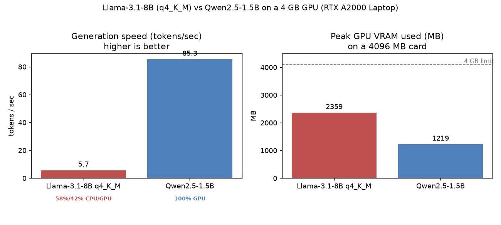

# Quantization / model-footprint benchmark: trade-offs on a 4 GB constrained GPU

**Hardware:** NVIDIA RTX A2000 Laptop GPU, **4 GB VRAM** (consumer-grade, close to an
iGPU-level constraint).
**Method:** Reuses the project's real RAG retrieval + prompt-construction path
([`scripts/benchmark_quantization.py`](../scripts/benchmark_quantization.py)), running 8
real queries 3 times each and recording time-to-first-token, tokens/sec, peak VRAM, and
Ollama's GPU/CPU layer split. Raw data: [`results/quantization_benchmark.csv`](../results/quantization_benchmark.csv).

## Why not the classic q4/q8/fp16 three-way comparison

The original plan was to compare Llama-3.1-8B at q4_K_M / q8_0 / fp16. That isn't feasible
on 4 GB VRAM:

| Version | Size | Fits in 4 GB? |
|---|---|---|
| 8B fp16 | ~16 GB | ❌ Outright OOM |
| 8B q8_0 | ~8.5 GB | ❌ Almost entirely offloaded to CPU |
| 8B q4_K_M (current) | ~4.9 GB | ⚠️ Still exceeds it — **58% of layers forced onto CPU** |

Running fp16 would just OOM, and q8_0 would mostly be benchmarking the CPU, not the GPU. So
the experiment became the **decision that actually applies to this hardware**: the
production 8B-q4_K_M (spilling to CPU) vs. a small model that fits entirely in VRAM,
Qwen2.5-1.5B.

## Results

| Model | tokens/sec | Time to first token | Peak VRAM | Layer split |
|---|---|---|---|---|
| **Llama-3.1-8B q4_K_M** (production) | **5.7** | 1789 ms | 2359 MB | 58%/42% CPU/GPU |
| **Qwen2.5-1.5B** | **85.3** | 623 ms | 1219 MB | 100% GPU |

## Conclusions

1. **The bottleneck is VRAM capacity, not quantization precision itself.** Even at 4-bit
   quantization, 8B-q4_K_M's ~5.7 GB runtime footprint still exceeds 4 GB, so Ollama pushes
   58% of its layers into system memory — that compute lands on the CPU, capping generation
   at **5.7 tok/s**. The 1.5B model, which fits entirely in VRAM, reaches **85.3 tok/s** —
   **~15× faster** — with time-to-first-token also almost 3× lower. Nearly the entire gap
   comes down to "does it stay 100% resident on the GPU," which is exactly the core of
   hardware-aware deployment: on constrained hardware, **whether a model fits in VRAM
   matters more for real throughput than raw parameter count**.

2. **Why this project still uses 8B-q4_K_M.** It's a quality/speed trade-off. The Hansard
   summarization task needs reliable bilingual (English/Malay) comprehension and accurate
   speaker names and `[n]` citations, and the 1.5B is noticeably weaker at all of these.
   q4_K_M is the **lowest precision at which the 8B model still runs at all** on 4 GB —
   going any higher (q8/fp16) would spill further or OOM outright. To offset the 5.7 tok/s
   latency, the production path uses **token-by-token streaming**
   (`stream_answer` in [`rag.py`](../library/myhansard/rag.py)), so the user sees progress
   immediately instead of waiting on the full generation.

3. **A transferable takeaway.** Deploy this same RAG on a machine with more VRAM and the 8B
   fits entirely resident — 5.7 → tens of tok/s is a "free" speedup with no model change
   needed. Conversely, to keep interactive speed on an even more constrained iGPU, a small
   model like the 1.5B plus streaming is the sound approach. **Quantize first, then check
   whether the model actually fits in the target VRAM — that's the first decision to make
   before deployment.**
