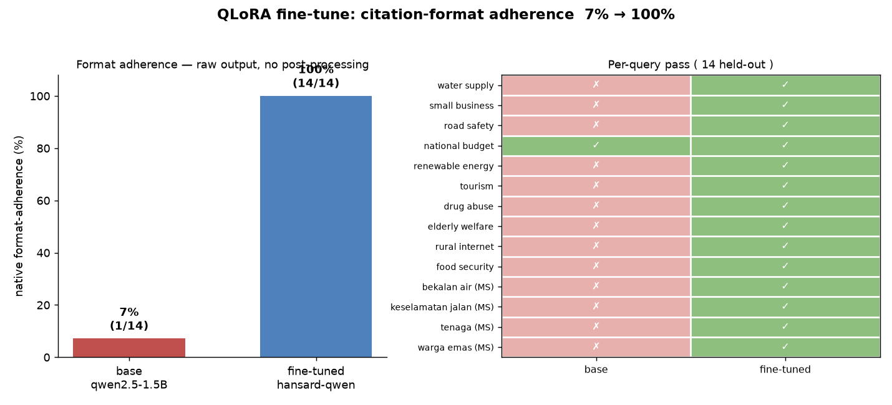

# QLoRA fine-tune — native citation-format adherence

**TL;DR** — Fine-tuning **Qwen2.5-1.5B** with QLoRA on 108 self-distilled examples
raised native output-format adherence from **7% → 100%** on held-out queries,
letting a small, fully-GPU-resident model emit the RAG's
`**Title**: Speaker (Constituency) … [n]` citation format **without any Python
post-processing**.



## Why this fine-tune

The RAG needs a strict answer format (numbered list, bold titles, speaker +
constituency, `[n]` citations). Small models don't hold it, so today the pipeline
enforces it in Python. Teaching the model the format natively shrinks that
scaffolding and lets a fast small model stand in for the 8B — which, on the 4 GB
GPU, spills ~58% of its layers to the CPU.

## Method

| | |
| --- | --- |
| **Data** | 108 `(retrieved context + question → formatted answer)` pairs, **self-distilled** from the production pipeline (real retrieval + 8B teacher + the existing Python cleanup). `build_finetune_data.py` |
| **Training** | 4-bit **QLoRA** (LoRA r=16, α=32), 3 epochs, free Colab **T4**. `train_qlora.ipynb` |
| **Metric** | 14 **held-out** queries (topics distinct from training), generated **raw** — single attempt, temperature 0.3, **no Python post-processing** — scored by the pipeline's own `_well_formatted` gate (≥2 `**bold-title**` list items). This isolates what the *model* learned, not what Python fixes. |

## Result

| model | native format-adherence |
| --- | --- |
| `qwen2.5:1.5b` (base) | 1/14 — **7%** |
| `hansard-qwen` (QLoRA) | **14/14 — 100%** |

<details><summary>Per-query (14 held-out)</summary>

| query | base | fine-tuned |
| --- | :---: | :---: |
| What concerns were raised about water supply? | ❌ | ✅ |
| What did members say about small business support? | ❌ | ✅ |
| What was discussed regarding road safety? | ❌ | ✅ |
| What issues came up about the national budget? | ✅ | ✅ |
| What did members say about renewable energy? | ❌ | ✅ |
| What was raised about tourism? | ❌ | ✅ |
| What concerns were there about drug abuse? | ❌ | ✅ |
| What did members say about the welfare of the elderly? | ❌ | ✅ |
| What was discussed about internet access in rural areas? | ❌ | ✅ |
| What did members say about food security? | ❌ | ✅ |
| Apakah yang dibincangkan tentang bekalan air? | ❌ | ✅ |
| Apa yang dibangkitkan tentang keselamatan jalan raya? | ❌ | ✅ |
| Apakah isu tentang tenaga boleh diperbaharui? | ❌ | ✅ |
| Apa yang dikatakan tentang kebajikan warga emas? | ❌ | ✅ |

</details>

## Evidence — same query, raw output

**Query:** *What did members say about small business support?*

**base `qwen2.5:1.5b`** — plain prose, no bold titles, no `[n]` citations:
```
1. Tuan Tan Kar Hing (Gopeng) asked for the Ministry to provide data on small
   businesses...
2. Datuk Muslimin bin Yahaya (Sungai Besar) suggested expanding microfinance
   schemes beyond hypermarkets and chain stores...
3. Tuan Tan Hong Pin (Bakri) proposed organizing NGO-led workshops...
```

**fine-tuned `hansard-qwen`** — bold titles, speaker + constituency, `[n]` citations:
```
**Small Business Support**: Datuk Muslimin bin Yahaya (Sungai Besar) proposed
  expanding microfinance skim for SMEs and microbusinesses [2].
2. **Microfinance Expansion**: Tuan Tan Kar Hing (Gopeng) requested that the
  ministry provide data on how small businesses can benefit... [3].
3. **E-Invois Implementation**: Datuk Ewon Benedick (Menteri Pembangunan
  Usahawan dan Koperasi) promised to reply on SME Corp and e-invois... [4].
```

## Limitations (measured honestly)

- **Format, not content.** The metric verifies *format*, which the model learned
  completely (100%). Content grounding is weaker: on the 108-example set the model
  occasionally echoes the few-shot example embedded in the prompt (e.g. the
  `Tuan Lim (Pulau Pinang) … flash floods` template line). Fixes: more distilled
  data, and dropping the in-prompt example now that the format is internalised.
- **Small eval.** 14 held-out queries on one domain; a larger set would tighten
  the estimate. Bilingual (EN/MS) queries are included.

## Reproduce

```bash
CUDA_VISIBLE_DEVICES="" uv run python finetune/evaluate.py qwen2.5:1.5b hansard-qwen
```
